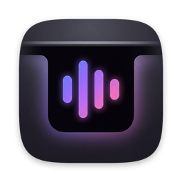

  

<h1 align="center">Simple Notch</h1>

  Now Playing, right in your MacBook's notch.

  <a href="https://github.com/jonasxwebdev/simple-notch/releases/latest"><strong>Download the latest release</strong></a>

---

Simple Notch is a small menu bar app. It puts the cover art and animated audio bars of whatever you're listening to next to your MacBook's camera notch. Hover over the notch to open a drawer with playback controls or an app launcher.

## Features

- **Compact Now Playing:** the cover art sits left of the notch. Audio bars on the right take their colours from the album art.
- **Hover drawer:** it shows playback controls, a launcher, or switches between them depending on whether something is playing.
- **Every display:** built-in displays get a shape attached to the notch. External monitors get a floating pill you can size and position.
- **Your music sources:** it can follow the system's Now Playing session or talk directly to Spotify or Apple Music.
- **Liquid Glass:** you can use native Liquid Glass on macOS 26 or a solid black surface.
- **Stays out of the way:** it can hide when an app is full screen or on external monitors.
- **Low idle power:** animation stops whenever it can't be seen, and polling slows down when the notch is hidden or your Mac is in Low Power Mode.
- **Reduce Motion aware:** with Reduce Motion on, animations become simple fades.

## Requirements

- macOS 14 Sonoma or later
- A Mac with a notch looks best, but external displays work too

## Install

1. Download `SimpleNotch-<version>.dmg` from the [latest release](https://github.com/jonasxwebdev/simple-notch/releases/latest).
2. Open the disk image and drag **SimpleNotch.app** into **Applications**.
3. Open it. Simple Notch runs from the menu bar and has no Dock icon.

The app is signed with a Developer ID and notarized by Apple. See [CHANGELOG.md](CHANGELOG.md) for what changed in each version.

## Permissions

If you choose Spotify or Apple Music as your source, macOS asks once for **Automation** access so Simple Notch can read what's playing and control playback. You can review this later under **System Settings → Privacy & Security → Automation**, or in Simple Notch's own **Permissions** settings.

The default **Now Playing** source works with any app that reports to macOS's Now Playing widget.

## Feedback

Found a bug or have an idea? [Open an issue](https://github.com/jonasxwebdev/simple-notch/issues).

## Acknowledgements

System-wide Now Playing uses [MediaRemote Adapter](https://github.com/ungive/mediaremote-adapter). See [THIRD_PARTY_NOTICES.md](THIRD_PARTY_NOTICES.md).
